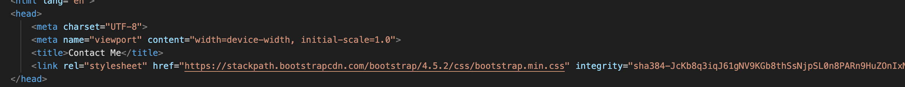
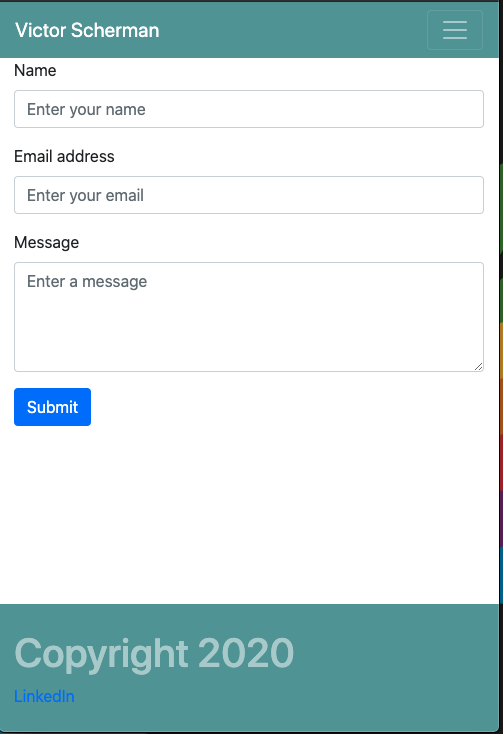
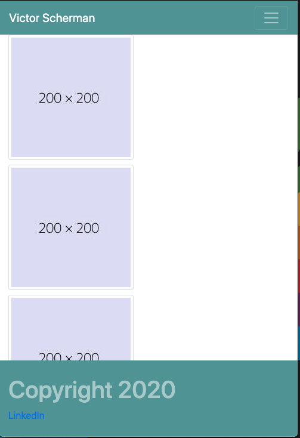
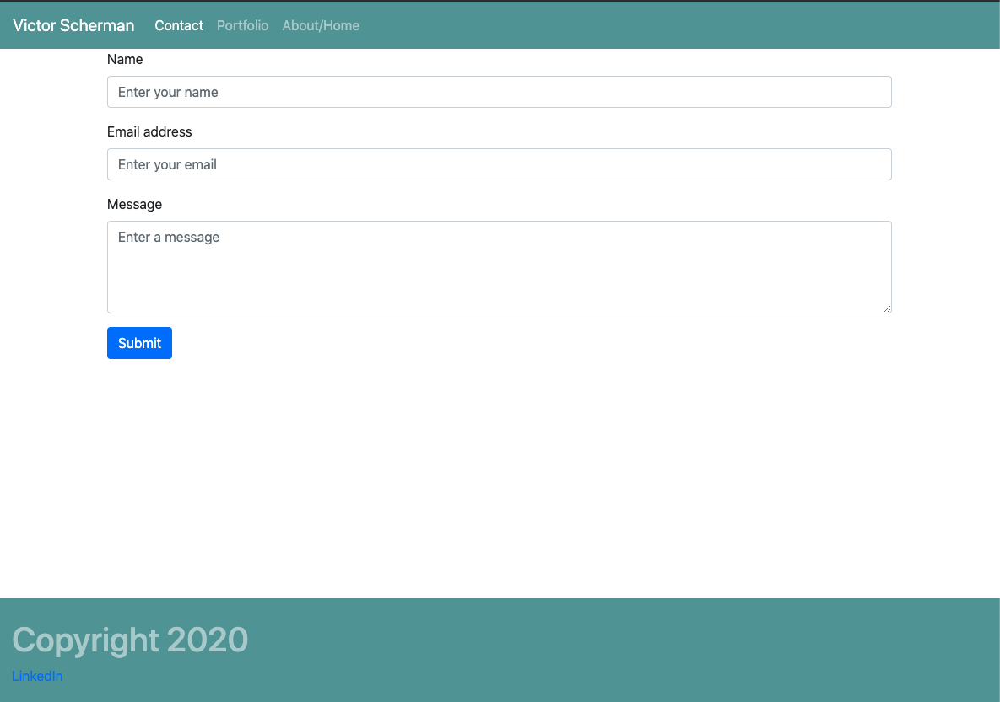
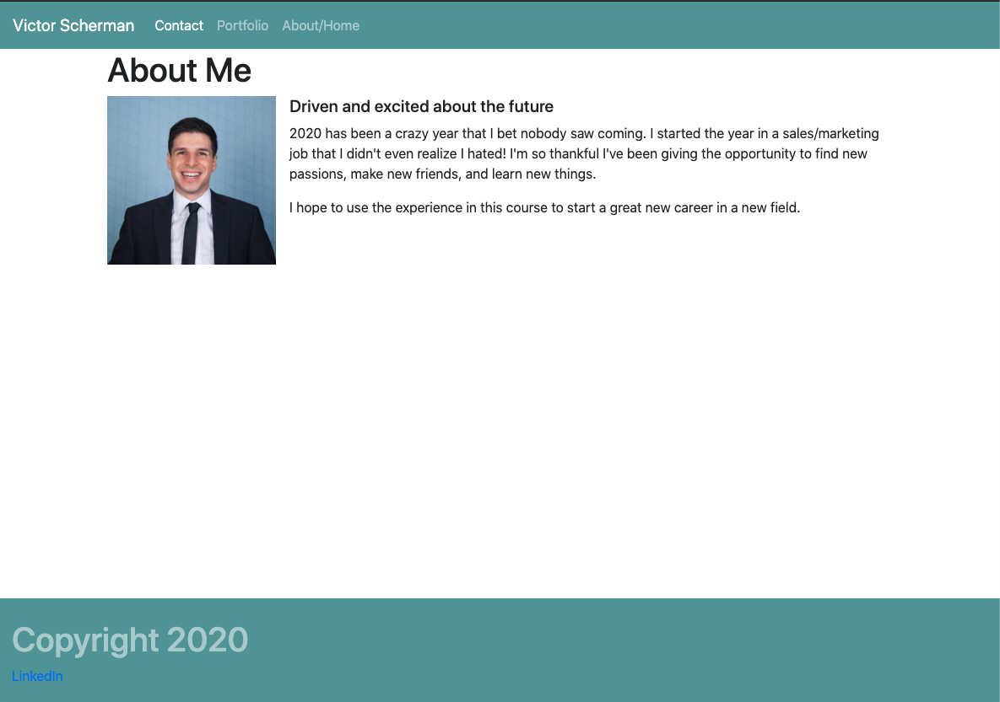
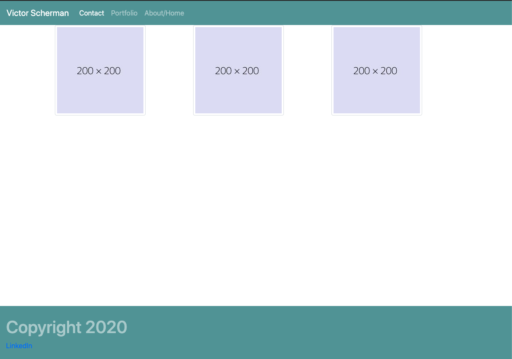

# homework2, Responsive Bootstrap Portfolio

Our job here was to make a responsive 3 page portfolio using bootstrap elements. It needs to satisfy the following requirements.

1. Contains a nav bar
2. Has a responsive layout
3. Has responsive images
4. Minimal usage of media queries (use bootstrap elements for sizing requirements)

Additionally, there are some other requirements the application must satisfy. They are:

1. Navbar needs to appear consistent across each page, containing links for "Home/About", "Contact", and Portfolio
2. It needs to use semantic HTML wherever possible.
3. Should contain personalized info.
4. Should use bootstrap components and grid system.

## What I did

I started off by creating 3 separate HTML files in my portfolio directory. I titled them

* contact.html
* index.html
* portfolio.html

These pages will serve as my contact page, home/about page, and portfolio page respectively.

# The Contact page

For all pages, I started by creating a basic HTML document using the (shift)! command to create some starter HTML with a viewport meta tag. This is important because the bootstrap elements I need to add later will require this meta tag. I then added a link to the head of my document to link our page to our bootstrap elements. See below



## The nav bar

Next, I set about choosing a nav bar that fit our project requirments. I chose one from bootstrap.com and modified it in the following ways (see comments in the html itself for further details).

1. I needed to change the background color. I did this by adding  a style=background color element to our opening ```<nav>``` tag, as follows

         <nav class="navbar navbar-expand-lg navbar-dark" style="background-color: cadetblue;">

2. I needed to make sure the navbar worked! I added in references to the other html pages in our project, an example is below:

      ```<a class="nav-link" href="contact.html">Contact</a>  ```


# The Contact form!

 I'm making progress! now we need to put a boostrap element in our page for contact info. I chose the following from bootstrap.com, and modified it as follows:


    <form>
            <!-- Changed the text in the following 3 form groups to reflect name, email, and message-->
        <div class="form-group">
          <label for="exampleFormControlInput1">Name</label>
          <input type="name" class="form-control" id="exampleFormControlInput1" placeholder="Enter your name">
        </div>

        <div class="form-group">
          <label for="exampleFormControlInput1">Email address</label>
          <input type="email" class="form-control" id="exampleFormControlInput1" placeholder="Enter your email">
        </div>
             <!-- Changed this element into a text box by changing input1 to text area 1. I also added a rows element and set it to 4 the appropriate bootstrap class was <textarea class="form control"-->
        <div class="form-group">
          <label for="exampleFormControlTextarea1">Message</label>
          <textarea class="form-control" id="exampleFormControlTextarea1" rows="4" placeholder="Enter a message"></textarea>
        </div>
        <!-- I added a submit button to our box as well-->

        <button type="submit" class="btn btn-primary">Submit</button>

      </form>```

# The footer

Next I made a footer using the following code:

       <div class="container-sm">

        <div class="row">

        <footer class="col-md-12 fixed-bottom py-4 text-white-50" style="background-color: cadetblue">
          <h1>Copyright 2020</h1>
          <a href="https://www.linkedin.com/in/victor-scherman-428a4566/?originalSubdomain=ca">LinkedIn</a>


           </footer> ```

   I also added a linked in to the footer to give a little link to my social media.
  Our footer and nav bar elements are repeated on all pages, so we don't need to explain how we worked them into index.html and contact.html.


# Our About/Home page

   I used the following bootstrap jumbotron element for this page, which required next to no modification to work. I put a nice little blurb in about myself too, because I'm excited to code! Perfect!!


       <div class="container-sm">
        <h1>About Me</h1>

        <div class="media">
            
            <div class="media-body">
              <h5 class="mt-0">Driven and excited about the future</h5>
              <p>2020 has been a crazy year that I bet nobody saw coming. I started the year in a sales/marketing job that I didn't even realize I hated! I'm so thankful I've been giving the opportunity to find new passions, make new friends, and learn new things.</p>
              <p>I hope to use the experience in this course to start a great new career in a new field.</p>
            </div>
          </div>```


# Our Portfolio

   Ah yes, the portfolio, you don't think I forgot about that? Here's what I did. 

1. I created a div called "container-sm" so that margins don't appear on xs screens.

2. I created a row to contain our images.

3. Because in this example I'm using 3 pictures, I wanted to make them take up 1/3 of their row on medium screens and up, and otherwise occupy a full row on smaller screens. I did this by specifying "col-md-4 col-12 pb2" This means on medium sized screens and up, each of our colums take up 1/3 of a row, and otherwise take up the whole row. The pb2 command adds some padding to the bottom so the images look nice and spaced out! Then I used the image thumbnail element from bootstrap to make sure the pictures have a nice white border.


   ```<div class="container-sm">

      <div class="row">

        <div class="col-md-4 col-12 pb-2">
        
        
        
        

        </div>
        <div class="col-md-4 col-12 pb-2">
        
        

        </div>

        <div class="col-md-4 col-12 pb-2">
        

        </div>
        
      <div>


# Some Pics

What good is a readme without some pictures? Feast your eyes on some pictures of the finished product.









## Special Thanks (in no particular order)
* My study group
* Fil
* Daniel
* My cats

## License

Copyright (c) 2020] [Victor Scherman]

Permission is hereby granted, free of charge, to any person obtaining a copy
of this software and associated documentation files (the "Software"), to deal
in the Software without restriction, including without limitation the rights
to use, copy, modify, merge, publish, distribute, sublicense, and/or sell
copies of the Software, and to permit persons to whom the Software is
furnished to do so, subject to the following conditions:

The above copyright notice and this permission notice shall be included in all
copies or substantial portions of the Software.

THE SOFTWARE IS PROVIDED "AS IS", WITHOUT WARRANTY OF ANY KIND, EXPRESS OR
IMPLIED, INCLUDING BUT NOT LIMITED TO THE WARRANTIES OF MERCHANTABILITY,
FITNESS FOR A PARTICULAR PURPOSE AND NONINFRINGEMENT. IN NO EVENT SHALL THE
AUTHORS OR COPYRIGHT HOLDERS BE LIABLE FOR ANY CLAIM, DAMAGES OR OTHER
LIABILITY, WHETHER IN AN ACTION OF CONTRACT, TORT OR OTHERWISE, ARISING FROM,
OUT OF OR IN CONNECTION WITH THE SOFTWARE OR THE USE OR OTHER DEALINGS IN THE
SOFTWARE.


